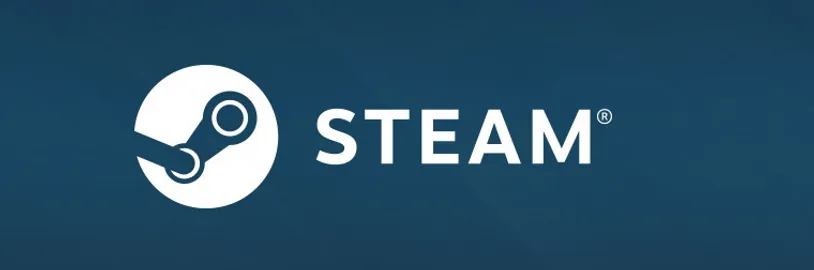
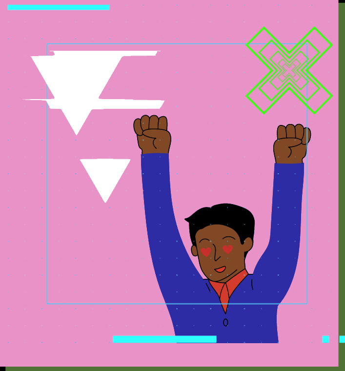

# Banco de Dados Steam

Nesse projeto, a Squad 4, formada no curso de Desenvolvimento Web pela Resilia Educação, composta pelos aspirantes a desenvolvedores Full Stack: Cindy Rocha, Diego Tavares, Isadora Sant'Ana e Magnus Arthur, foi desafiada a explorar o Banco de Dados da plataforma Steam.

# Desafio 
A nossa facilitadora tech, Karlla Souzza, pediu que desenvolvessemos principlamente a criatividade, com o intuito de criar perguntas as quais serão respondidas por intermédio de códigos estudados durante o referido Módulo, nesses códigos entramos dentro das informações contidas no Banco de Dados da Steam.

# Projeto 
Para responder as perguntas das queries tivemos a ideia de criar uma história em torno de um personagem fictício "Bruno", e ao longo da historia as perguntas eram respondidas atravez de uma busca ao banco de dados. Portanto, embarcamos nesse desafio a fim de suprir todas as expectativas de Bruno, desde suas preferencias, tempo disponível, suas condições financeiras entre outros.

# Queries
1- Todos os jogos de ação
2- Todos os jogos da valve
3- Quantos jogos eu tenho
4- Jogos no carrinho
5- Quais são as descrições dos jogos
6- Valor total

# Status do Projeto 
Finalizado
[19:01]
# Ferramentas Utilizadas 
- SUPABASE
- VISUAL STUDIO
- GIT
- GIT HUB
- TRELLO
- DISCORD
- GOOGLE PLANILHAS
- GOOGLE DOCUMENTOS
- CANVA

Agregando à nossa evolução, nossa facilitadora tech, nos apresentou ferramentas como MongoDB, MySQL Workbranch, Supabase, Laragon, Br Modelo, e outros. Nesse projeto, utilizamos especialmente o Supabase e o MySQL Workbranch. Estimulados também, por nossa facilitadora soft, Letícia Santana, a trabalhar a organização e comunicação, utilizamos Trello, Canca, Planilhas e Grupo da Squad.

# Nossa Equipe 

# Conclusões 
Logo, conseguimos desenvolver, além de todas as habilidades com as ferramentas e com conteúdo passado, harmonia e parceria no trabalho em equipe, bem como, a capacidade de aprender a aprender e de ajudar uns aos outros compartilhando conhecimentos.

Esperamos demonstrar nosso desenvolvimento enquanto aprendizes e contribuir como um bom exemplo de projeto!

SQUAD 4.
